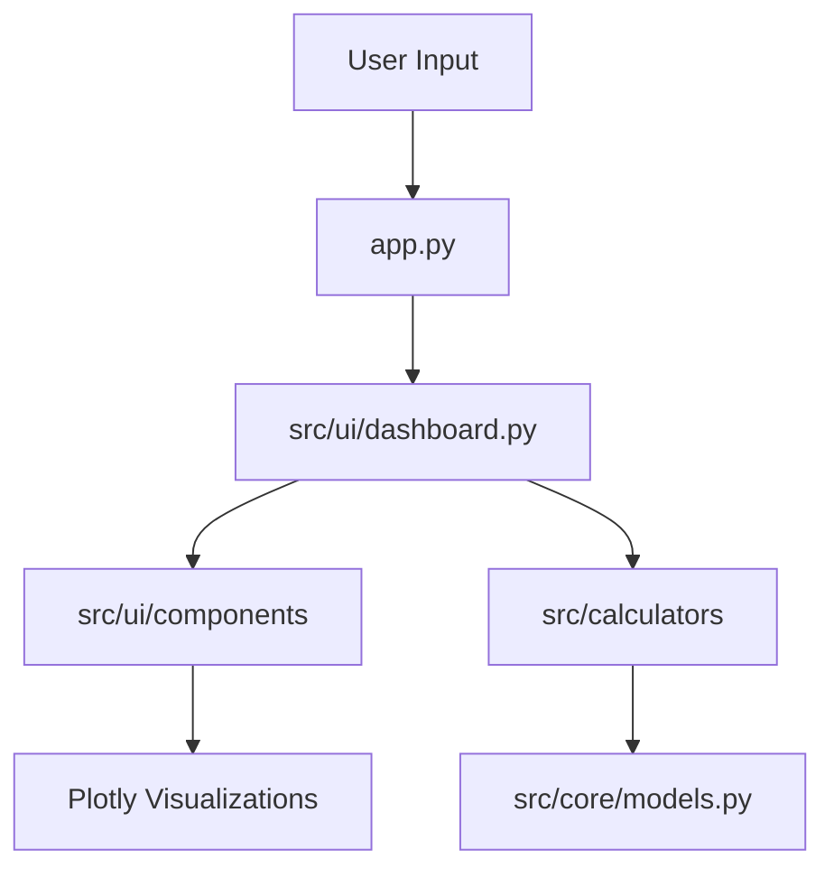

# System Architecture

The Software Metrics Calculator is built with a production-grade modular architecture that emphasizes high cohesion and low coupling.

## Directory Structure

- `app.py`: Minimal entry point for the Streamlit application.
- `src/`:
    - `core/`: Contains domain models and essential data structures (e.g., `CodeMetrics`).
    - `calculators/`: contains the core business logic and analysis algorithms.
        - `code_analyzer.py`: AST-based Python code analysis.
        - `estimation.py`: COCOMO modeling.
        - `agile.py`: Agile and sprint metrics processing.
    - `ui/`: Presentation layer logic.
        - `dashboard.py`: Main dashboard orchestration.
        - `components/`: Modular, reusable UI components (sidebar, charts, metrics cards).
    - `utils/`: Shared utility functions.

## Core Components

- **Domain Layer (`src/core`)**: Defines the data contracts used across the system, ensuring type safety and consistency.
- **Analysis Engine (`src/calculators`)**: Isolated logic for calculating software metrics. This separation allows for testing individual algorithms without UI overhead.
- **Presentation Layer (`src/ui`)**: Orchestrates the user interface using Streamlit, decoupled from the underlying analysis logic.

## Data Flow



## Java 静态分析主链路（CoDiver Pipeline）

### 真实调用栈

```
app.py::main()                                   # 上传 .java，组装 java_config 开关
  └─ java_analyzer/dashboard.py::handle_analysis(source_code, config)
       └─ analyzer_engine.py::StaticAnalyzerEngine(code, config)
            ├─ _initialize_detectors()           # 从 detectors.base 注册表按
            │                                    #   (priority, detector_id) 排序实例化
            └─ run()
                 ├─ javalang.parse.parse(code)   # 源码 → AST；失败 → ValueError（整体退化）
                 ├─ for detector in detectors:   # 逐个隔离执行 detect(tree, lines)
                 │    ├─ detectors/design.py::DesignSmells          (priority 10)
                 │    ├─ detectors/implementation.py::ImplementationSmells (priority 20)
                 │    ├─ detectors/naming_docs.py::NamingSmells     (priority 30)
                 │    └─ detectors/naming_docs.py::DocumentationSmells (priority 40)
                 ├─ utils/helpers.py::deduplicate_issues()   # 多源告警去重
                 ├─ 按注册顺序归因，累计各检测器 weighted_penalty
                 └─ utils/helpers.py::calculate_normalized_score()  # 钳在 0–100
       └─ 结果写入 st.session_state（analysis_results / pipeline_report / pipeline_score）
  └─ java_analyzer/dashboard.py::display_analysis_results()
       ├─ utils/ui_components.py::render_executive_summary()  # 旧公式质量分
       └─ dashboard.py::render_pipeline_page()   # 管线页：注册顺序、命中数、归一化评分
```

### 取舍一：规则 id 撞车与注册顺序

- 每个检测器类声明 `detector_id`、`priority`、`config_key`，定义时经
  `CodeSmell.__init_subclass__` 自动注册进 `detectors/base.py` 的全局注册表。
- **撞车策略：先注册者生效。** 两个类声明同一个 `detector_id` 时，后注册的被跳过并记入
  `registry_conflicts()`，管线页会列出 "kept X, skipped Y"。子类若想覆盖父类规则，
  沿用父类 id 会被判撞车丢弃——必须换新 id 并自选 priority。这样解析结果只取决于
  类定义顺序，而不取决于谁后 import，行为可预测、可在页面上审计。
- **注册顺序由显式 priority 决定，而非 import 顺序**：design(10) → implementation(20)
  → naming(30) → documentation(40)，即架构级先于实现级、风格级。顺序只影响两件事：
  去重后告警**归因**给最早报告它的检测器，以及管线表里的展示次序；因为去重时严重度
  取最高值，所以总分与顺序无关（见取舍三，两条规则互相印证）。

### 取舍二：单检测器异常的就地隔离

- `run()` 把每个 `detector.detect()` 包在独立 try/except 里：某检测器抛异常时，
  该检测器在 `pipeline_report` 中标记 `status="degraded"`、记录错误、贡献 0 条告警，
  **其余检测器照常执行，互不影响**。
- 降级检测器**被排除在评分之外**（其 `normalized_score` 为 None），总分只由正常
  检测器的告警计算。因此总分是乐观上界，管线页会显示黄色警告明示哪些检测器被排除，
  避免"挂了反而满分"的静默假象。
- 注意区分两级退化：检测器级异常 → 就地隔离；**AST 解析失败是整体退化**，`run()`
  抛 `ValueError`，`handle_analysis` 捕获后把 `pipeline_status` 置为 `parse_failed`，
  管线页显示"评分不可用 (N/A)"而不是误导性的 0 或 100。

### 取舍三：多源告警去重加权与评分钳制

- **去重**：`deduplicate_issues()` 以 `(Type, Target)` 为键合并多源重复告警；
  保留注册顺序最早的一条作为规范条目，但 Severity/Reason 升级为所有重复中的最高
  严重度。因此总分对检测器顺序不敏感，归因（各检测器命中数）才与顺序有关——与
  取舍一的注册顺序规则闭环。
- **加权**：`SEVERITY_WEIGHTS = {Critical: 4, High: 3, Medium: 2, Low: 1}`，
  每单位权重扣 `PENALTY_PER_WEIGHT = 5` 分。
- **钳制**：`score = clamp(100 − Σ weight(severity) × 5, 0, 100)`，下限 0 上限 100。
  **数据缺失走独立退化路径**：`calculate_normalized_score(None)` 返回 `None`，
  UI 渲染 N/A，绝不落到 0 或 100。
- 各检测器的归一化评分用同一公式作用于其归因告警，且
  `Σ 各检测器 weighted_penalty = 总 weighted_penalty`，页面上每个数字都能手工复算。
- 另：Executive Dashboard 的 Quality Score 仍沿用旧公式
  `max(0, 100 − 2×总告警 − 10×Critical)`（`calculate_quality_score`），与管线页的
  加权归一化分是两套口径，页面分别标注，不要混用。

### 复算示例（tests/sample_data/SampleSmells.java）

对该样例跑一次完整管线，结果与 `tests/test_pipeline.py`、
`tests/test_pipeline_page.py` 的断言逐条一致：

| 顺序 | 检测器 | 命中（去重后） | 告警明细 | 加权扣分 | 归一化评分 |
|---|---|---|---|---|---|
| 1 | design | 1 | Lazy Class (Low) | 5 | 95 |
| 2 | implementation | 2 | Empty Catch Block (Critical), Long Parameter List (Low) | 25 | 75 |
| 3 | naming | 2 | Invalid Class Name (Low), Invalid Method Name (Low) | 10 | 90 |
| 4 | documentation | 2 | Missing Class Documentation (Low), Missing Method Documentation (Low) | 10 | 90 |

合计：7 条告警，总扣分 5+25+10+10 = 50，**综合评分 = clamp(100 − 50, 0, 100) = 50**。
（同一文件在 Executive Dashboard 的旧公式下为 100 − 2×7 − 10×1 = 76，口径不同属预期。）
