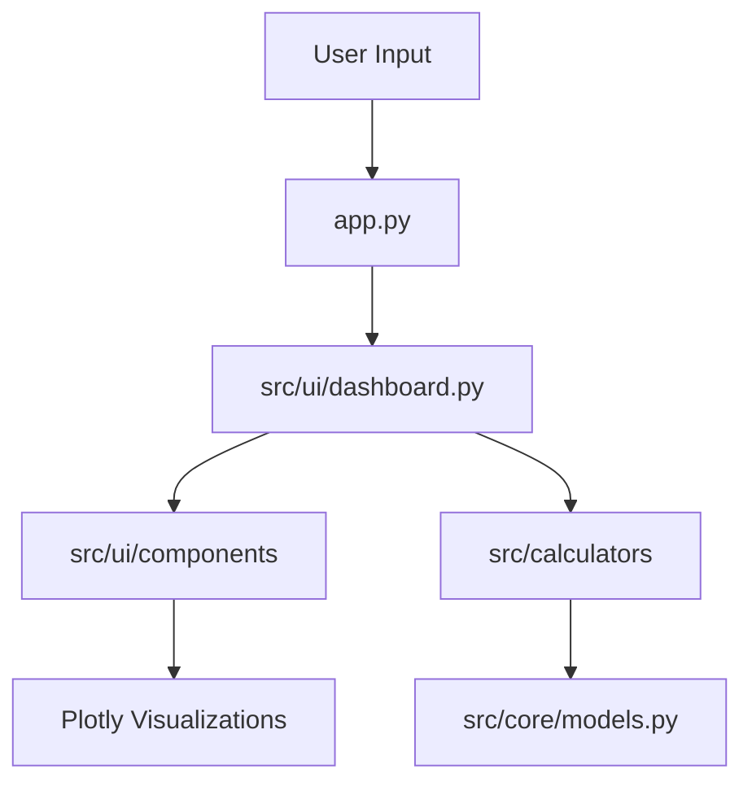

# System Architecture

The Software Metrics Calculator is built with a production-grade modular architecture that emphasizes high cohesion and low coupling.

## Directory Structure

- `app.py`: Minimal entry point for the Streamlit application.
- `src/`:
    - `core/`: Contains domain models and essential data structures (e.g., `CodeMetrics`).
    - `calculators/`: contains the core business logic and analysis algorithms.
        - `code_analyzer.py`: AST-based Python code analysis.
        - `estimation.py`: COCOMO modeling.
        - `agile.py`: Agile and sprint metrics processing.
    - `ui/`: Presentation layer logic.
        - `dashboard.py`: Main dashboard orchestration.
        - `components/`: Modular, reusable UI components (sidebar, charts, metrics cards).
    - `utils/`: Shared utility functions.

## Core Components

- **Domain Layer (`src/core`)**: Defines the data contracts used across the system, ensuring type safety and consistency.
- **Analysis Engine (`src/calculators`)**: Isolated logic for calculating software metrics. This separation allows for testing individual algorithms without UI overhead.
- **Presentation Layer (`src/ui`)**: Orchestrates the user interface using Streamlit, decoupled from the underlying analysis logic.

## Data Flow



## Java 静态分析管线（CoDiver 主链路）

### 真实调用栈

```
app.py (Java 标签页, 点击 "Execute CoDiver Analysis")
  └─ java_analyzer.dashboard.handle_analysis(source_code, java_config)
       └─ StaticAnalyzerEngine(source_code, config)
            ├─ _initialize_detectors()          # 按 DETECTOR_REGISTRY 注册顺序 × config 开关实例化
            └─ run()
                 ├─ javalang.parse.parse(code)   # 解析失败 → ValueError, 全部检测器标记 skipped
                 ├─ for detector in detectors:  # 逐个执行, try/except 就地隔离
                 │     detector.detect(tree, lines) -> List[issue]
                 ├─ deduplicate_issues(all_issues)        # 多源告警去重
                 ├─ normalize_score(weighted_hits)        # 每个检测器归一化评分
                 └─ engine.pipeline_report                # 汇总: 注册顺序/命中数/评分/总分
       └─ st.session_state["pipeline_report"] = engine.pipeline_report
  └─ render_pipeline_page()                   # dashboard.py 管线页, 渲染上表
  └─ display_analysis_results()               # 指标/图表/明细 (utils/ui_components.py)
```

检测器全部继承 `detectors/base.py` 的抽象类 `CodeSmell`，实现 `detect(tree, lines)`，
通过 `analyzer_engine.register_detector()` 注册进有序字典 `DETECTOR_REGISTRY`。
内置注册顺序固定为 `design → implementation → naming → documentation`。

### 取舍一：规则 id 撞车与注册顺序

- **检测器 id 撞车：先注册者生效。** `register_detector()` 发现 `detector_id`
  已存在时，保留原注册、忽略后注册者（包括试图覆盖父类的子类），并向
  `REGISTRY_WARNINGS` 追加一条告警，管线页 "Registry warnings" 折叠面板可见。
  子类要替换父类必须换用新 id，或在测试里显式重置注册表；Python 层面的
  方法覆盖（MRO）只在类继承内部生效，不影响注册表。
- **注册顺序凭什么定：** 按"架构级 → 实现级 → 表面级"排序——design（God Class
  等架构债）最先，implementation（复杂度、空 catch）其次，naming/documentation
  这类表层规则最后。该顺序决定两件事：(1) 管线页表格的行序；(2) 告警去重平局时
  谁生效（见取舍三）。顺序固定后，无论 import 顺序如何，管线行为都是确定性的。

### 取舍二：单检测器异常的就地隔离

- `run()` 中每个 `detector.detect()` 独立包在 try/except 里。某个检测器抛异常时：
  该行标记 `status="error"` 并记录 `error` 信息，贡献 0 条告警，**不进入**
  issues 列表，也**不参与总分均值**；其余检测器照常执行，互不受污染。
- 解析阶段失败（`JavaSyntaxError` 等）是全局性失败，无法就地隔离：所有未运行的
  检测器标记 `skipped`，抛出 `ValueError` 交给 `handle_analysis` 提示用户，
  但 `pipeline_report` 仍会写入 session state，管线页据此展示退化原因。

### 取舍三：多源告警去重加权、评分钳制与退化路径

- **去重：** 两条告警的规则键 `(Type, Target)` 相同即撞车，严重度权重高者生效
  （`SEVERITY_WEIGHTS`: Critical=4, High=3, Medium=2, Low=1）；权重相同则保留
  注册顺序靠前的检测器发出的那条。被丢弃的条数计入
  `duplicates_removed = raw_issues - total_issues`。
- **归一化评分（页上每个数字均可复算）：**
  - 单检测器加权命中 `weighted_hits = Σ SEVERITY_WEIGHTS[issue.Severity]`（按该
    检测器去重后存活的告警计）；
  - 单检测器评分 `score = clamp(100 - 5 × weighted_hits, 0, 100)`（`ISSUE_PENALTY=5`）；
  - 总分 `overall = round(mean(score_d))`，仅对 `status="ok"` 的检测器取均值，
    结果同样钳在 0–100。
- **退化路径（数据缺失时）：** 全部检测器被配置关闭、全部异常、或源码解析失败时，
  没有任何可用评分，`overall_score = None`，管线页显示 "N/A" 并给出退化说明，
  而不是静默默认为 100 分；`analysis_metrics` 缺失时管线页仍可独立渲染，
  因为它只依赖 `pipeline_report`。

> 注：`utils/helpers.py` 的 `calculate_quality_score()` 是 Executive Dashboard
> 沿用的旧公式（`100 - 2×总数 - 10×Critical`，下限 0）；管线页的归一化评分
> 以本节公式为准，两者并存但口径不同。
